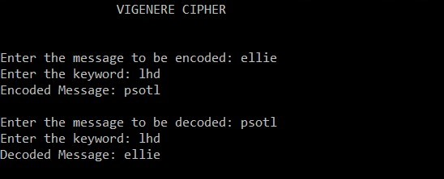

# psotl
This code lets you Encrypt as well as Decrypt various messages using The Vigenère Cipher.   For example: Decode **pstol** using the keyword *lhd* and this will reveal the actual name of the Repo. Below is an output of the same.  

